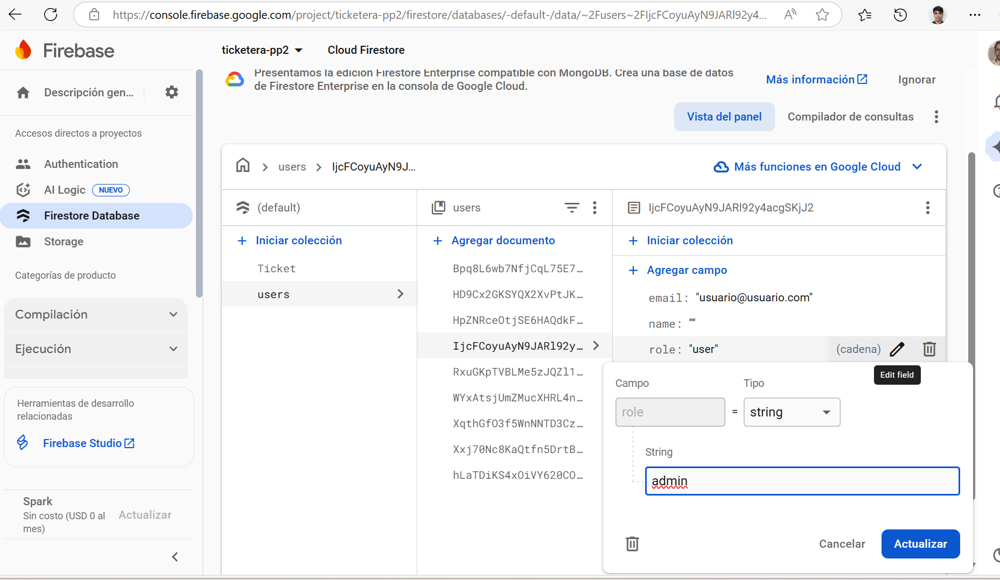

# 🎫 Proyecto Ticket de Plataformas

## 👥 Integrantes
- 👩‍💼 Ariadna Prado  
- 👨‍💼 Martín Faraguna  
- 👨‍💻 Matías Campopiano  
- 👨‍🔧 Eduardo Burgos Montaño  

---

## 📋 Trello  
Puedes seguir el progreso aquí:  
https://trello.com/invite/b/67f05bdca67a90187a960705/ATTI86c9d29c48705476c3cb5426a9a2227d3F17195A/ticket-de-plataformas

---

## ⚙️ Instalación del proyecto  

1. 🔽 Clonar el proyecto:  
   `git clone https://github.com/MartinFaraguna/PP2-Standalone.git`  

2. 📦 Instalar dependencias:  
   `npm install`  

3. ▶️ Ejecutar la app:  
   - Si tienes Ionic CLI:  
     `ionic serve`  
   - Si no tienes Ionic CLI:  
     `npm run start`  
     La aplicación correrá en: http://localhost:4200/

---

## 🖼️ Pantallas  

### 🔐 Pantalla de logeo  

---

### 📝 Pantalla de registro  

#### 🔒 Restricciones para la contraseña  

---

### 🏠 Home  
Donde un usuario visualiza sus tickets:  

Desde aquí también puede dar de alta un ticket:  

---

### 🛠️ Panel de administrador  
Visualiza tickets y sus estados:  

Agregar comentarios a un ticket:  

Cambiar estado del ticket:  
(Abierto, Cerrado, En Proceso)  

---

### 🛠️ Otorgar rol de administrador

Para otorgar el rol de **administrador**, primero necesitas tener un usuario registrado con email y contraseña.

---

1️⃣ **Ingresar a la consola de Firebase:**  
   👉 [https://console.firebase.google.com/](https://console.firebase.google.com/project/ticketera-pp2/overview)

2️⃣ **Ir a la pestaña Firestore Database:**  
   👉 Dentro de tu proyecto, selecciona **Firestore Database** en el menú lateral.

3️⃣ **Editar la colección `users`:**  
   - Abre la colección `users`.
   - Selecciona el documento del usuario al que deseas otorgar permisos de administrador.
   - Localiza el campo `role` (por defecto está como `"user"`).
   - Edita el valor y reemplázalo por `"admin"`.

---

✅ **Listo:**  
Al volver a iniciar sesión con este usuario (email y contraseña), será redirigido automáticamente al **panel de administrador**.

